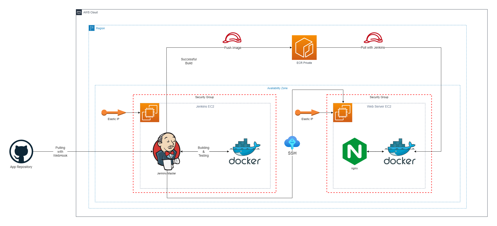

# First Demo Project - CI/CD Pipeline with GitHub Webhook, Jenkins, and Docker

### Overview

This project demonstrates the implementation of a Continuous Integration and Continuous Deployment (CI/CD) pipeline using a combination of GitHub, Jenkins, Docker, AWS EC2, and AWS ECR. The pipeline automates the process of taking a Flask application from a GitHub repository, building a Docker image, running tests, deploying the image to AWS ECR, and then deploying the application on another AWS EC2 instance with nginx as a reverse proxy.

### Pipeline Workflow

The CI/CD pipeline consists of the following stages:

1. **GitHub Webhook Trigger:** When changes are pushed to the GitHub repository, the GitHub webhook triggers the Jenkins job.

2. **Jenkins Build:** Jenkins pulls the code, builds a Docker image, and runs unit tests.

3. **AWS ECR Push:** The Docker image is pushed to AWS Elastic Container Registry (ECR).

4. **SSH into Deployment EC2:** Jenkins logs into another AWS EC2 instance via SSH.

5. **AWS ECR Pull:** The deployment EC2 instance pulls the Docker image from ECR.

6. **Docker Container Deployment:** The Docker container is started and served via nginx.

    